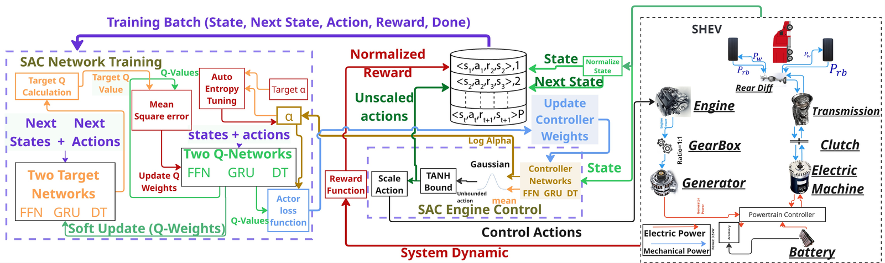
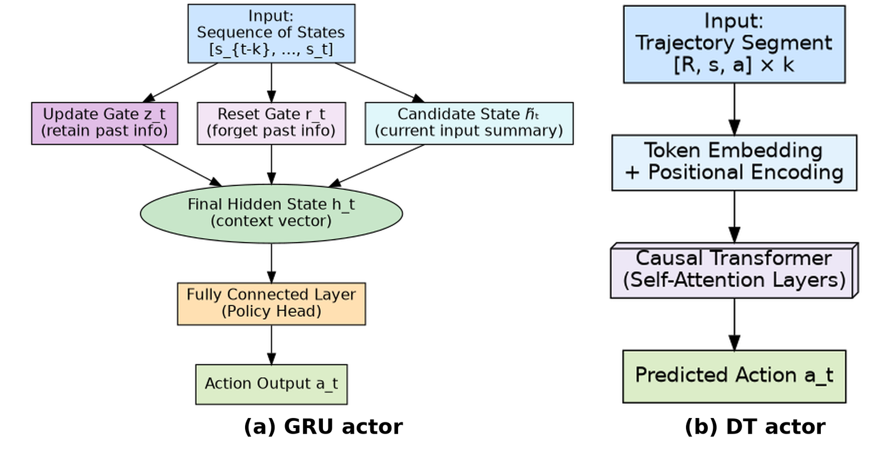
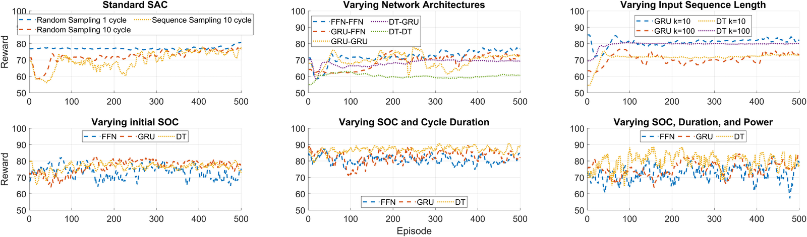
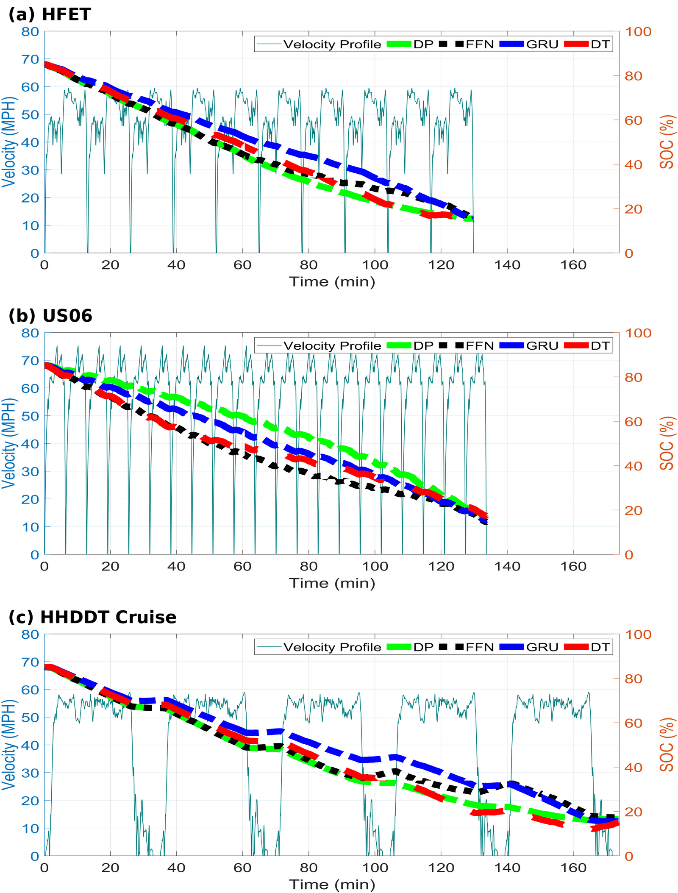

# Sequence-Aware Soft Actor-Critic for a Series Hybrid Truck

Code for **"Sequence Aware Soft Actor-Critic Control Agents for Series Electrified
Powertrain"**, W. Jaleel, M. R. Rownak, A. Hanif, S. G. Bhatti and Q. Ahmed,
*American Control Conference (ACC)*, 2026.

Soft Actor-Critic engine control for a Class-8 series hybrid electric vehicle, with
feed-forward, GRU and Decision Transformer actors and critics, benchmarked against dynamic
programming.

## Abstract

As Hybrid Electric Vehicles gain traction in heavy-duty trucks, adaptive energy management is
critical for minimising fuel consumption and maintaining battery charge over long operations.
We present a reinforcement learning framework for engine control in series HEVs, based on Soft
Actor-Critic framed as a sequential decision-making problem. Standard feed-forward networks in
the actor and critic are replaced with temporal models, Gated Recurrent Units and Decision
Transformers, to better capture sequential dependencies. Through comprehensive ablation
studies we identify two high-performing and well-generalised sequence-aware configurations: a
DT actor with a GRU critic (DT-GRU), and a GRU actor with a GRU critic (GRU-GRU). Validation
compares these agents against Dynamic Programming across two training setups: one trained on a
single standard cycle (HFET), and another using a wider range of initial SOCs, drive durations
and power demands. On the training cycle the DT-GRU agent achieved fuel performance within
1.8 % of DP, outperforming GRU-GRU and FFN-FFN at 3.16 % and 3.43 %. On the unseen highway
cycles, one with significantly higher power demand (US06) and one with extended operation time
(HHDDT), both sequence-aware agents generalised better than the FFN-FFN agent.

## Framework



*Fig. 1: SHEV architecture with the SAC training setup. Actor, critic and target critic are
configurable as FFN, GRU or DT, together with the replay buffer and loss modules.*

The engine drives a generator that charges the battery, which powers the electric machine at
the wheels. The SAC agent commands engine speed and torque; the actor and both critics are
independently configurable as FFN, GRU or DT.

**State** `s_t = [SOC_t, D_t, P_EM,t]` — state of charge, distance travelled, and electric
machine power demand.
**Action** `a_t = [omega_eng,t, T_eng,t]` — engine speed and torque, tanh-bounded into the
feasible engine map.
**Reward** Eq. 4: a fuel term `-w_fuel * mdot_fuel * SOC_initial^2` plus SOC shaping that
rewards terminating in the 15–18 % charge-depleting band and penalises excursions below 15 %
and above 85 %.

## Method

| Variant | Actor | Critic | Idea |
|---|---|---|---|
| FFN-FFN | feed-forward | feed-forward | memoryless baseline; each step treated independently |
| GRU-FFN | GRU | feed-forward | recurrent actor, memoryless value estimate |
| GRU-GRU | GRU | GRU | short- to mid-term temporal dependencies on both sides |
| DT-GRU | Decision Transformer | GRU | return-conditioned causal attention over a `k`-step window, Bellman critic |
| DT-DT | Decision Transformer | Decision Transformer | critic regresses return-to-go instead of bootstrapping |



*Fig. 2: (a) GRU architecture, (b) DT architecture.*

Three modifications to standard SAC carry the sequence models: inference input padding
(short histories are padded by repeating the initial observation, masked in the loss), an
episodic replay buffer that stores whole trajectories and samples `k`-step windows at random
offsets, and per-variant training frequencies chosen so every lane has comparable wall-clock
per episode. Temperature `alpha` is auto-tuned to `H_target = -dim(A) = -2`.

## Results

Six ablation studies, 500 episodes each, fixed seed:



*Fig. 3: Ablation results (episode vs. reward) across six settings: sampling strategy and
episode length, actor-critic architecture, input sequence length k, initial SOC, cycle
duration, and EM demand scaling.*

Sequence models handle long episodes better and converge faster under fixed conditions. GRU
critics beat DT critics by roughly three reward points, confirming Bellman estimation is more
effective than return regression for the critic. DT improves with longer context (`k = 100`);
GRU prefers shorter (`k = 10`).

SOC trajectories against DP on the training cycle and two unseen cycles:



*Fig. 4: Battery SOC trajectories for DP (green), FFN (black), GRU (blue) and DT (red) with
velocity profiles (cyan) across (a) HFET, (b) US06, (c) HHDDT Cruise.*

**Table III — agents trained on HFET only (Study 3)**

| | HFET SOC_f | HFET MPG | US06 SOC_f | US06 MPG | HHDDT SOC_f | HHDDT MPG |
|---|---|---|---|---|---|---|
| DP | 15.55 | 23.71 | 16.44 | 4.63 | 16.45 | 21.83 |
| FFN | 15.90 | 22.89 (-3.43 %) | 17.80 | 3.87 (-16.48 %) | 21.31 | 17.76 (-18.61 %) |
| GRU | 15.51 | 22.96 (-3.16 %) | 16.30 | 4.20 (-9.34 %) | 15.30 | 18.57 (-14.90 %) |
| DT | 15.58 | **23.28 (-1.80 %)** | 17.10 | 3.95 (-14.60 %) | 14.30 | 21.19 (-2.90 %) |

**Table IV — generalised agents (Study 6)**

| | HFET SOC_f | HFET MPG | US06 SOC_f | US06 MPG | HHDDT SOC_f | HHDDT MPG |
|---|---|---|---|---|---|---|
| DP | 15.55 | 23.71 | 16.44 | 4.63 | 16.45 | 21.83 |
| FFN | 15.81 | 20.73 (-12.57 %) | 14.67 | 4.27 (-7.72 %) | 17.29 | 18.82 (-13.81 %) |
| GRU | 15.10 | 21.07 (-11.14 %) | 15.63 | **4.43 (-4.24 %)** | 15.59 | 19.04 (-12.80 %) |
| DT | 15.38 | **21.68 (-8.54 %)** | 17.58 | 4.04 (-12.69 %) | 15.23 | **20.75 (-4.93 %)** |

`6_paper_figures.ipynb` redraws Fig. 4 and Table IV from the shipped traces in
`results/validation/` and reproduces the published values. Agents trained only on HFET degrade by more than 15 % on unseen cycles; the generalised
agents trade a little HFET performance for markedly better robustness. GRU's recurrent memory
suits US06's short high-power bursts, while DT's attention suits HHDDT's 34.6-minute
sub-cycles. At inference every architecture produces an action in under 5 ms, well inside the
1 s control interval.

## Data

`data/cycles/` **is** distributed: four drive-cycle files holding `speed_vector`,
`acceleration_vector`, `elevation_vector` (all zero, flat highway) and `gearnumber_vectorRUL`
at 1 Hz. The speed traces are EPA dynamometer drive schedules.

`data/maps/` and `data/params/` are **not** distributed. The engine, generator and battery
maps and the vehicle parameter structs are derived from proprietary sources. `DATA.md` lists
what each file holds and its shape, so an equivalent set can be substituted. Missing files
raise an error naming the file and where it was looked for.

So a bare clone can redraw Fig. 4 and Tables III and IV from the shipped traces, but cannot
run the plant or train an agent without supplying `data/maps/` and `data/params/`.

`results/validation/` and `results/dp/plain/` do ship, so Fig. 4 and Tables III and IV redraw
without them.

## Setup

```
pip install -r requirements.txt
```

The notebooks add the repository root to `sys.path`, so no install step is needed.

## Layout

```
plant/          the Class-8 vehicle: engine, generator, battery, drive cycles
sasac/
  envs/         the RL wrapper around plant/: episode, reward, presets
  models/       FFN, GRU and Decision Transformer actors and critics
  agent.py      SAC, any actor with any critic
  train.py      training loop
  buffers/      transition replay (FFN), episodic sequence replay (GRU/DT)
  config.py     YAML-backed configuration
  utils/        live plots, figures, MATLAB weight conversion, agent probes
notebooks/      21 training notebooks, plus evaluate and figures
configs/        one YAML per run: ablation/, paper/, validation/
scripts/        build_notebooks.py (regenerates the notebooks)
results/        shipped validation traces, DP results
figures/        figures used above, written by 6_paper_figures.ipynb
```

The vehicle lives in `plant/` and nowhere else. `sasac/envs/` wraps it for training: it
decides how much of the cycle to run, at what initial SOC and power scale, and scores the
result. Precomputing the cycle's motor power demand keeps a step at roughly 25 us.

## Run order

One notebook per config, named `<stage>_<index>_<name>.ipynb`. The stage is the run order:
finish every stage 1 before starting stage 2. Runs inside a stage are independent and can go
in parallel; stages 2-4 are continued training (paper Sec. IV-A), so their order is not
optional.

```
0_*      3 standalone Table II configurations, depend on nothing
1_*      9 runs from scratch                  (studies 1-3)
2_*      varying initial SOC                  (study 4)
3_*      and cycle duration                   (study 5)
4_*      and EM power                         (study 6)  -> the Table IV agents
5_, 6_   evaluate_agents, paper_figures
```

`notebooks/README.md` has the per-stage tables, each run's parent, and the parallel launch
pattern. A notebook whose parent has not run stops and says which one to run first;
`load_from: null` trains it from scratch instead.

Regenerate the notebooks after editing a config or the generator:

```
python scripts/build_notebooks.py
```

Rebuild the DP arrays from solved workspaces, if you have them:

```
python -c 'from sasac.utils.dp_profile import export_all; export_all()'
```
## Notebooks are generated

`scripts/build_notebooks.py` writes one notebook per config, deriving the stage prefix from
each config's `load_from` chain. Edit the generator, not a `.ipynb`.

## Citation

```bibtex
@inproceedings{jaleel2026sasac,
  author    = {Jaleel, Wafeeq and Rownak, Md Ragib and Hanif, Athar
               and Bhatti, Sidra Ghayour and Ahmed, Qadeer},
  title     = {Sequence Aware Soft Actor-Critic Control Agents for
               Series Electrified Powertrain},
  booktitle = {American Control Conference (ACC)},
  year      = {2026},
}
```

All authors are with the Center for Automotive Research, The Ohio State University,
Columbus, OH, USA.
